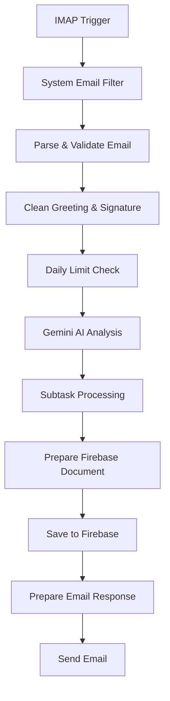

# n8n Workflow — Automated Email-to-Task Pipeline

This repository contains the updated n8n workflow for automated email parsing, AI-driven task extraction, and Firebase integration. The core **Join** project remains untouched in the `main` branch.

## 🚀 Key Features

*   **Robust Email Parsing:** Enhanced extraction with automatic category detection.
*   **Rate Limiting:** Enforces daily request quotas via Firebase Realtime Database.
*   **AI-Powered Processing:** Utilizes Gemini AI optimized for multilingual (English/German) inputs.
*   **Fault-Tolerant Architecture:** Zero-crash design with safe fallbacks for missing or malformed data.

---

## 🔧 Detailed Modifications

### IMAP Email Parsing
*   **Advanced Extraction:** Improved parsing for sender, subject, body, and metadata.
*   **Intelligent Classification:** Automatically detects request types (*feature, bug, question, improvement*).
*   **Spam Filtering:** System emails (e.g., `info@...`, `noreply@...`) are automatically blocked.
*   **Safe Defaults:** Added reliable fallback values for missing fields.

### Daily Limit Check (Firebase Realtime Database)
*   **Quota Enforcement:** Tracks and implements daily request limits per user.
*   **Dynamic Updates:** Integrated PUT/PATCH logic for creating and updating limit documents.
*   **Resilience:** Fully fault-tolerant node featuring retry logic and an automatic fallback mode.

### Gemini AI Processing
*   **Localization:** Updated prompts to correctly handle German language inputs.
*   **Data Extraction:** Enhanced parsing of titles, descriptions, dates, and subtasks.
*   **Validation:** Safe fallback behavior triggers if the AI output is invalid or incomplete.

### Subtask Processing
*   **Safe Parsing:** Subtasks are parsed consistently without breaking the pipeline.
*   **Auto-Indexing:** Generates unique IDs automatically for every subtask.
*   **Error Prevention:** Node no longer crashes when subtasks are missing or malformed.

### Firebase Document Preparation
*   **Zero-Error Design:** Rewritten from scratch to be completely error-proof.
*   **Schema Enforcement:** Ensures Firebase always receives a valid task object.
*   **Safe Fields:** Mandatory fields (`type`, `title`, `userEmail`) utilize secure defaults.

### Email Responses
*   **Success Template:** Updated with detailed task information and daily limit statistics.
*   **Limit Alerts:** New template specifically designed for users who exceed their daily quota.
*   **Rich Text:** Improved HTML formatting and edge-case fallback handling.

---

## 🔀 Workflow Structure

The workflow executes strictly in the following sequential order:

---

## ✔ Summary of Workflow State

The updated n8n workflow is officially:
*   **Stable** & fault-tolerant
*   **AI-enhanced** via Gemini
*   **Firebase-compatible** with schema enforcement
*   **Protected** against malformed emails and quota abuse

*Note: The Join main project remains unchanged.*
