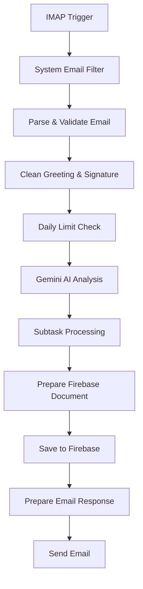

# JOIN – Kanban Project Management Tool

A modern Kanban board application for managing tasks, subtasks, and contacts.
Originally built as a team project by three Frontend Developers at the Developer Akademie.

This repository contains three branches:

- **main** – the full JOIN web application
- **n8n** – an optional automation workflow for email-to-task processing
- **upload** – builds on both `main` and `n8n`, adding file upload functionality

The main application works completely standalone. The n8n workflow is fully isolated and does not modify the JOIN codebase. The upload branch integrates and extends both.

---

## 🚀 Features

### Core Application (main branch)
- Create an account or use guest mode
- Manage contacts (create, edit, delete)
- Automatic account-contact creation
- Profile picture upload
- Create tasks with title, description, subtasks, attachments
- Assign tasks to contacts
- Drag-and-drop Kanban board
- Task stages: **To Do**, **In Progress**, **Awaiting Feedback**, **Done**
- Summary page with live statistics
- Fully responsive design
- Firebase Realtime Database integration

### Optional Automation (n8n branch)
- Email parsing via IMAP
- AI-powered task extraction (Gemini, optimized for English/German inputs)
- Automatic task creation in Firebase
- Daily request limits per user
- Spam filtering
- Fault-tolerant workflow with safe fallbacks
- Automatic email responses (success, limit exceeded)

---

## 🛠 Technologies Used

- HTML
- CSS
- JavaScript
- Firebase

---

## 🧩 Project Structure

```
JOIN/
│ index.html
│ script.js
│ style.css
│ config.js
│
├── html/
│   ├── add-task.html
│   ├── board.html
│   ├── contacts.html
│   ├── summary.html
│   ├── login.html
│   ├── signup.html
│   ├── help.html
│   ├── legal-notice.html
│   └── privacy-policy.html
│
├── styles/
│   ├── add-task.css
│   ├── board.css
│   ├── contacts.css
│   ├── contacts-dialog.css
│   ├── contacts-overview.css
│   ├── contact-show.css
│   ├── navigation.css
│   ├── summary.css
│   └── …
│
└── scripts/
    ├── add-task.js
    ├── add-task-visuals.js
    ├── board.js
    ├── board-design.js
    ├── board-subtask.js
    ├── board-tasks.js
    ├── contacts.js
    ├── contacts-dialog.js
    ├── contacts-overview.js
    ├── firebase.js
    ├── navigation.js
    ├── signup.js
    ├── login.js
    ├── summary.js
    ├── templates.js
    └── imagePicker.js
```

---

## ⚙️ Installation & Setup

### 1. Clone the repository

```bash
git clone https://github.com/PatrickSchuette/JOIN
```

### 2. Install dependencies (only required for n8n)

The JOIN web application itself does not require npm. If you want to use the n8n workflow:

```bash
npm install
```

This installs:
- n8n
- IMAP nodes
- Firebase nodes
- Gemini AI nodes

If you only want to run JOIN → npm is **not** required.

---

## 🔧 config.js – n8n Settings

The `config.js` file contains:


**Enable/Disable n8n integration**

```js
const USE_N8N = false;   // n8n disabled
```

To activate n8n:

```js
const USE_N8N = true;
```

JOIN works fully without n8n — it is an optional automation layer.

---

## 🤖 n8n Workflow (optional)

The `n8n` branch provides an automated email-to-task pipeline. The core JOIN project in the `main` branch remains untouched.

### Key Features
- **Robust Email Parsing** – enhanced extraction with automatic category detection
- **Rate Limiting** – enforces daily request quotas via Firebase Realtime Database
- **AI-Powered Processing** – uses Gemini AI, optimized for multilingual (English/German) inputs
- **Fault-Tolerant Architecture** – zero-crash design with safe fallbacks for missing or malformed data

### Detailed Modifications

**IMAP Email Parsing**
- Improved parsing for sender, subject, body, and metadata
- Automatically detects request types (feature, bug, question, improvement)
- Spam filtering blocks system emails (e.g. `info@...`, `noreply@...`)
- Reliable fallback values for missing fields

**Daily Limit Check (Firebase Realtime Database)**
- Tracks and enforces daily request limits per user
- PUT/PATCH logic for creating and updating limit documents
- Fault-tolerant with retry logic and automatic fallback mode

**Gemini AI Processing**
- Localized prompts for German-language inputs
- Extracts titles, descriptions, dates, and subtasks
- Safe fallback behavior if AI output is invalid or incomplete

**Subtask Processing**
- Subtasks are parsed consistently without breaking the pipeline
- Auto-generates unique IDs for every subtask
- No longer crashes when subtasks are missing or malformed

**Firebase Document Preparation**
- Rewritten to be fully error-proof
- Enforces a valid task object schema
- Mandatory fields (`type`, `title`, `userEmail`) use secure defaults

**Email Responses**
- Success template with detailed task information and daily limit statistics
- Dedicated template for users who exceed their daily quota
- Improved HTML formatting with edge-case fallback handling

### Workflow Structure

The workflow executes strictly in the following sequential order:



### ✔ Summary of Workflow State

The n8n workflow is:
- **Stable** & fault-tolerant
- **AI-enhanced** via Gemini
- **Firebase-compatible** with schema enforcement
- **Protected** against malformed emails and quota abuse

*Note: The JOIN main project remains unchanged.*
## 📁 File Upload Extension (file-upload branch)

The `file-upload` branch adds client-side attachment support to the JOIN task creation workflow.  
This feature is fully optional and does not modify the core logic of the `main` branch.

### 🔥 Key Features
- Drag‑and‑drop upload area in **Add Task**
- Visual preview of selected files
- Client-side validation:
  - Allowed types: **JPEG**, **PNG**
  - Automatic rejection of unsupported formats
- Multiple file support (configurable)
- Clean UI feedback for hover, drop, and selection states
- Safe fallback behavior if no files are selected
- Non-breaking: tasks still work without attachments

### 🧱 Technical Overview
- New styles in `imageGalery.css`
- Upload logic implemented in:
  - `add-task.js`
  - `add-task-visuals.js`
- File metadata stored inside the task object
- Ready for backend or Firebase Storage integration (upload hooks included)

### ⚙️ How It Works
1. User drags or selects a file  
2. File is validated (type + size)  
3. Preview is rendered immediately  
4. On task creation, file metadata is attached to the task  
5. Optional: enable Firebase Storage upload in `config.js`


---

## 🛠 Development Notes

- Open `index.html` directly in your browser
- Firebase works without a local server
- The n8n workflow requires a local or cloud n8n instance

---

## 🙏 Acknowledgements

This project was built as a team project by a group of three Frontend Developers studying at the Developer Akademie.

---

## 📄 License

This project is licensed under the MIT License. See the `LICENSE` file for details.